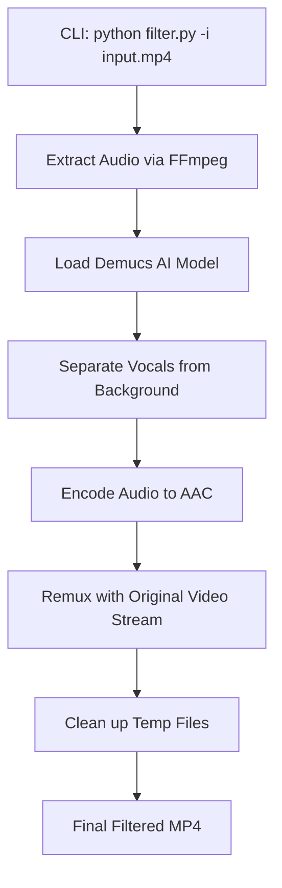

# Product Requirements Document (PRD)
# YT Audio Filter (Python CLI Tool)

---

## 1. Executive Summary

**Product Name:** YT Audio Filter (CLI)  
**Version:** 1.0  
**Date:** December 27, 2025  
**Author:** Product Team

### 1.1 Vision Statement
A high-performance Python CLI tool that allows developers and power users to remove background music from local MP4 clips. It leverages state-of-the-art AI (Demucs) to isolate vocals while maintaining original video quality through lossless remuxing.

### 1.2 Problem Statement
Existing GUI tools are often bloated or cloud-dependent. Users need a scriptable, local solution that can be integrated into larger workflows or run simply from a terminal to clean up background audio in MP4 files.

---

## 2. Goals & Success Metrics

### 2.1 Primary Goals
| Goal | Description |
|------|-------------|
| **Scriptable CLI** | Simple command-line interface with argparsing |
| **Local Processing** | Purely local execution using PyTorch/FFmpeg |
| **High Fidelity** | Maximum vocal preservation with 0% video quality loss |
| **Portability** | Easy installation via pip/conda environment |

### 2.2 Key Performance Indicators (KPIs)
- **Ease of Install:** Complete setup in < 3 commands.
- **Reliability:** 100% success rate on H.264/AAC MP4 containers.
- **Flexibility:** Support for both CPU and GPU (automatic detection).

---

## 3. Functional Requirements

### 3.1 Core Features

#### 3.1.1 CLI Interface
| Requirement ID | Description | Priority |
|----------------|-------------|----------|
| FR-001 | Accept input path via `--input` or positional argument | P0 |
| FR-002 | Accept output path via `--output` (optional, defaults to `_filtered`) | P0 |
| FR-003 | Toggle for GPU/CPU processing via `--device` | P1 |
| FR-004 | Verbose logging for debugging and progress tracking | P1 |

#### 3.1.2 Audio Handling
| Requirement ID | Description | Priority |
|----------------|-------------|----------|
| FR-010 | Automated audio extraction (FFmpeg) | P0 |
| FR-011 | AI separation using `demucs` library | P0 |
| FR-012 | Output clean vocal track as temporary WAV | P0 |

#### 3.1.3 Video Remuxing
| Requirement ID | Description | Priority |
|----------------|-------------|----------|
| FR-020 | Remux processed audio with original video stream | P0 |
| FR-021 | Strict lossless video copy (`-c:v copy`) | P0 |
| FR-022 | Support for varying sample rates and AAC encoding | P0 |

---

## 4. Technical Architecture

### 4.1 CLI Workflow

### 4.2 Tech Stack
| Component | Technology |
|-----------|------------|
| **Language** | Python 3.10+ |
| **AI Model** | Facebook Demucs (via `demucs` and `torch`) |
| **Media Handling** | `ffmpeg-python` or direct `subprocess` calls |
| **Environment** | Conda or Virtualenv |

---

## 5. Timeline & Roadmap
- **Phase 1:** Basic script that extracts audio, runs Demucs, and outputs a WAV.
- **Phase 2:** Integrate FFmpeg remuxing to produce the final MP4.
- **Phase 3:** CLI optimization (argparse, logging, progress bars).

---

## 6. Out of Scope
- Graphical User Interface (GUI).
- Direct YouTube downloading.
- Cloud API hosting.
